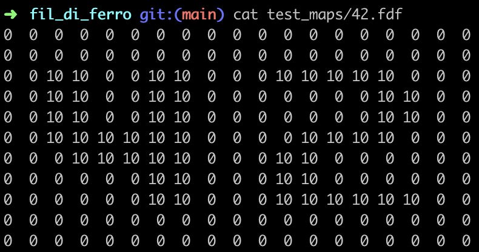

# fil_di_ferro

School 21 project 
Basics of graphic programming

## Status

IN PROGRESS

## Description

This project is about creating a simplified graphic wireframe representation of a relief landscape linking various points via segments. The coordinates of this landscape are stored in a file passed as
a parameter. 

Each number in the file corresponds to a point in space:

<ul>
  <li>The horizontal position corresponds to its axis</li>
  <li>The vertical position corresponds to its ordinate</li>
  <li>The first value corresponds to its altitude</li>
  <li>The second value (if exists) corresponds to its color</li>
</ul>

## Installation

	git clone --recurse-submodules https://github.com/hgrranzi/fil_di_ferro.git

For Mac OS:

	make

For Linux:

	git checkout linux
	make

## Getting started

	./fil_di_ferro [path to the config file with the fdf extention]

Example:

	./fil_di_ferro test_maps/europe.fdf

## Preview

Keyboard control

<ul>
  <li><b>+</b>:      ...</li>
  <li><b>+</b>:      ...</li>
  <li><b>+</b>:      ...</li>
  <li><b>+</b>:      ...</li>
  <li><b>+</b>:      ...</li>
  <li><b>+</b>:      ...</li>
</ul>

